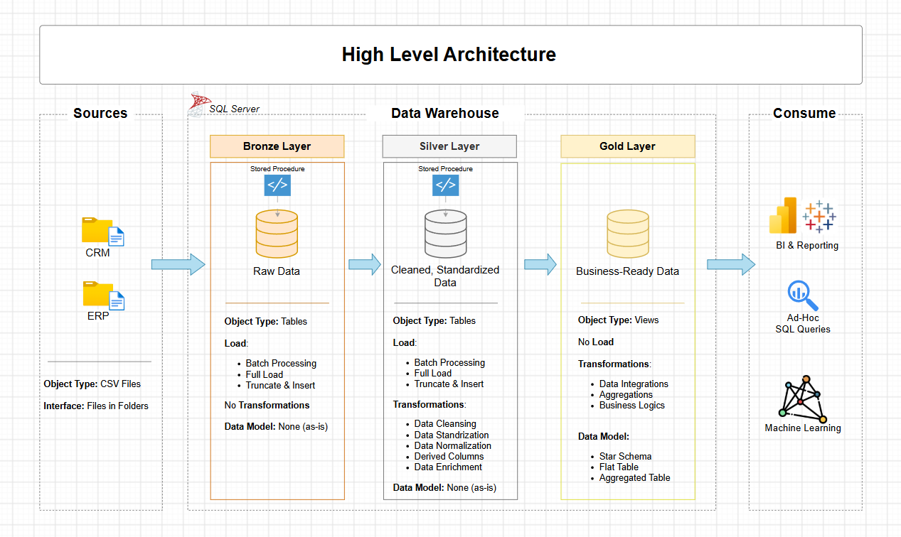

# Data Warehouse and Analytics Project

Welcome to my **Data Warehouse and Analytics Project** repository! 🚀

This project demonstrates an end-to-end **data warehousing and analytics solution**, covering data ingestion, data cleaning, transformation, data modeling, and analytical reporting using **SQL Server**.

The project is designed as a portfolio project to demonstrate practical skills in **SQL, ETL, data modeling, data analytics, and business intelligence**.

---

## 🏗️ Data Architecture

The data architecture follows the **Medallion Architecture**, consisting of three layers:

**Bronze → Silver → Gold**



### 1. Bronze Layer

The Bronze layer stores the **raw data as received from the source systems**.

* Data is sourced from CSV files.
* Raw ERP and CRM datasets are loaded into SQL Server.
* Minimal transformation is performed at this stage.
* The purpose is to preserve the original source data.

### 2. Silver Layer

The Silver layer focuses on **data cleaning, standardization, and transformation**.

Key activities include:

* Handling missing and invalid values
* Removing duplicates
* Standardizing data formats
* Validating data quality
* Resolving inconsistencies between ERP and CRM sources
* Preparing data for analytical modeling

### 3. Gold Layer

The Gold layer contains **business-ready analytical data**.

The data is organized using a **Star Schema**, consisting of:

* Fact tables
* Dimension tables
* Business-friendly fields
* Measures required for reporting and analysis

---

## 📖 Project Overview

The project covers the complete data analytics workflow:

### 1. Data Architecture

Designed a modern data warehouse using the **Bronze, Silver, and Gold architecture**.

### 2. ETL Pipelines

Built SQL-based processes to:

* Extract data from CSV source files
* Load raw data into the Bronze layer
* Clean and transform data in the Silver layer
* Prepare analytical datasets in the Gold layer

### 3. Data Modeling

Designed a **Star Schema** to make analytical queries simpler and more efficient.

### 4. Data Analysis

Developed SQL queries to analyze:

* Customer behavior
* Product performance
* Sales trends
* Revenue patterns
* Customer and product metrics

### 5. Reporting & Insights

Created analytical outputs that can help stakeholders understand business performance and make **data-driven decisions**.

---

## 🎯 Skills Demonstrated

This project demonstrates practical experience with:

* **SQL**
* **SQL Server**
* **ETL / ELT Concepts**
* **Data Cleaning**
* **Data Transformation**
* **Data Modeling**
* **Star Schema**
* **Fact & Dimension Tables**
* **Medallion Architecture**
* **Data Quality Testing**
* **Business Analytics**
* **Analytical SQL Queries**
* **Git & GitHub**

---

## 🛠️ Tools & Technologies

| Tool / Technology                       | Purpose                                 |
| --------------------------------------- | --------------------------------------- |
| **SQL Server**                          | Database and data warehouse             |
| **SQL Server Management Studio (SSMS)** | Database development and management     |
| **SQL**                                 | Data transformation and analysis        |
| **Draw.io**                             | Data architecture and modeling diagrams |
| **Git & GitHub**                        | Version control and project management  |
| **CSV**                                 | Source data                             |
| **Power BI**                            | Business intelligence and visualization |

---

## 📊 Analytics & Reporting

The Gold layer is used to generate analytical insights across three major business areas.

### 👥 Customer Behavior

Analysis includes:

* Customer purchasing patterns
* Customer segmentation
* Customer contribution to revenue
* Customer activity and performance

### 📦 Product Performance

Analysis includes:

* Top-performing products
* Product sales trends
* Product contribution to revenue
* Product category performance

### 📈 Sales Trends

Analysis includes:

* Sales over time
* Revenue trends
* Regional performance
* Monthly and yearly sales patterns
* Key sales metrics

---

## 📂 Repository Structure

```text
data-warehouse-and-analytics-project/
│
├── datasets/                              # Raw ERP and CRM CSV datasets
│
├── docs/                                  # Project documentation
│   ├── etl.drawio                         # ETL process diagram
│   ├── data_architecture.drawio           # Data warehouse architecture
│   ├── data_architecture.png              # Architecture image
│   ├── data_flow.drawio                   # Data flow diagram
│   ├── data_models.drawio                 # Star schema/data model
│   ├── data_catalog.md                    # Dataset and column documentation
│   ├── naming-conventions.md              # Naming standards
│   └── requirements.md                    # Business requirements
│
├── scripts/                               # SQL scripts
│   ├── bronze/                            # Raw data ingestion scripts
│   ├── silver/                            # Data cleaning and transformation
│   └── gold/                              # Analytical models and views
│
├── tests/                                 # Data quality and validation scripts
│
├── README.md                              # Project documentation
├── LICENSE                                # Project license
├── .gitignore                             # Git ignored files
└── requirements.txt                       # Project requirements
```

---

## 🔄 Data Flow

The overall data flow of the project is:

```text
CSV Source Files
       │
       ▼
┌─────────────────┐
│  Bronze Layer   │
│   Raw Data      │
└────────┬────────┘
         │
         ▼
┌─────────────────┐
│  Silver Layer   │
│ Clean & Transform│
└────────┬────────┘
         │
         ▼
┌─────────────────┐
│   Gold Layer    │
│  Star Schema    │
└────────┬────────┘
         │
         ▼
┌─────────────────┐
│ SQL Analytics   │
│ & BI Reporting  │
└─────────────────┘
```

---

## 🧪 Data Quality & Testing

Data quality checks are performed throughout the ETL process.

Examples include:

* Checking for duplicate records
* Identifying NULL values
* Validating data types
* Checking invalid dates
* Validating customer and product relationships
* Checking referential integrity
* Comparing source and transformed record counts
* Identifying inconsistent or unexpected values

These checks help ensure that the final Gold-layer data is reliable for analytics.

---

## 📐 Data Modeling

The Gold layer follows a **Star Schema** approach.

A typical structure consists of:

```text
              ┌─────────────────┐
              │ Dim Customers   │
              └────────┬────────┘
                       │
                       │
┌─────────────────┐    │    ┌─────────────────┐
│ Dim Products    │────┼────│   Fact Sales    │
└─────────────────┘    │    └────────┬────────┘
                       │             │
                       │             │
              ┌────────┴────────┐    │
              │   Dim Dates     │────┘
              └─────────────────┘
```

The fact table stores measurable business events, while dimension tables provide descriptive information used to analyze those events.

---

## 🚀 Project Objectives

The main objectives of this project are to:

* Build a structured SQL data warehouse
* Integrate data from multiple source systems
* Improve data quality through transformation
* Create an analytical data model
* Write efficient SQL queries
* Generate business-focused insights
* Demonstrate an end-to-end data analytics workflow

---

## 💡 Key Learning Outcomes

Through this project, I developed practical understanding of:

* How raw business data moves through an ETL pipeline
* How data warehouses are structured
* How Bronze, Silver, and Gold layers work
* How to clean and transform real-world datasets
* How to design fact and dimension tables
* How Star Schema supports analytics
* How SQL can be used to answer business questions
* How data quality affects analytical results
* How technical data workflows connect to business decision-making

---

## 📌 Portfolio Project

This project is part of my **Data Analytics portfolio** and demonstrates my ability to work with data from ingestion through transformation and analysis.

It combines my interest in **SQL, data analytics, business intelligence, and data-driven problem solving**.

---

## 👩‍💻 About Me

Hi! I'm **Tanya Nagar**

I am currently building my skills in **Data Analytics, SQL, Python, Power BI, and AI**, with the goal of applying technology and data to solve real-world business problems.

### Technical Skills

* SQL
* Python
* Power BI
* Excel
* Data Analysis
* Data Visualization
* Data Modeling
* ETL Concepts
* Git & GitHub

---


